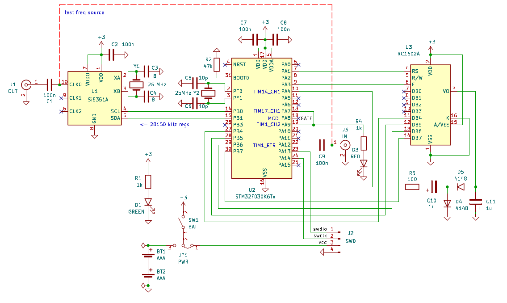
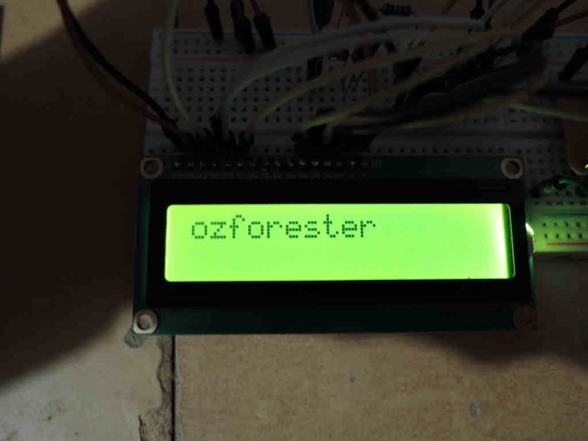
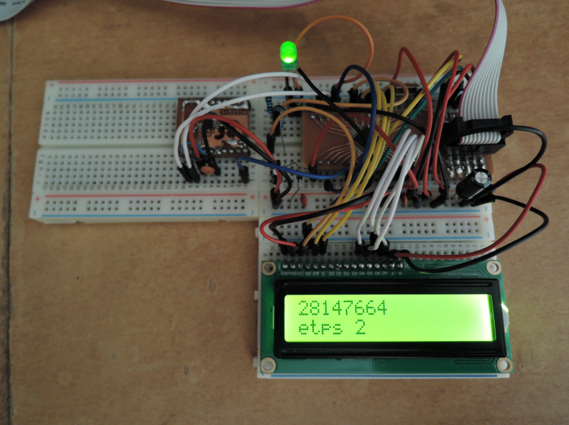

# Pwm biased HD44780 (+frequency counter template) 
uc stm32f030k6t6/lcd hd44780/hw (kicad) 
tune bias with TIM14 duty cycle 
freqmeter template, just for fun  

# Финт с триггером измерительного интервала для восьмипинового v003j4m6: 
Первый таймер-счетчик управляется внутренним триггером второго таймера как обычно.
Второй таймер генерит триггер по воему первому каналу сравнения
Также второй таймер генерит прерывание по своему второму каналу.
Второй канал, например, через 10 тактов таймера. Первый - через 100. Перегрузка - через 1100.
Таким образом между второым и первым сравнениями читаются счетчик первого таймера, а высокий уровень триггера и новый интервал начинаются после сохранения счетчика предыдущего интервала.
Обработка и вывод как обычно. 
